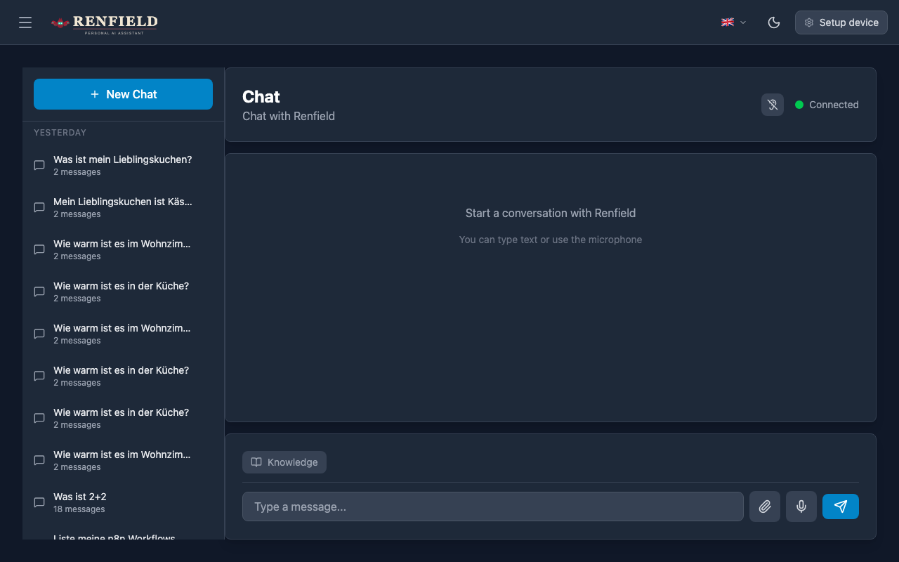
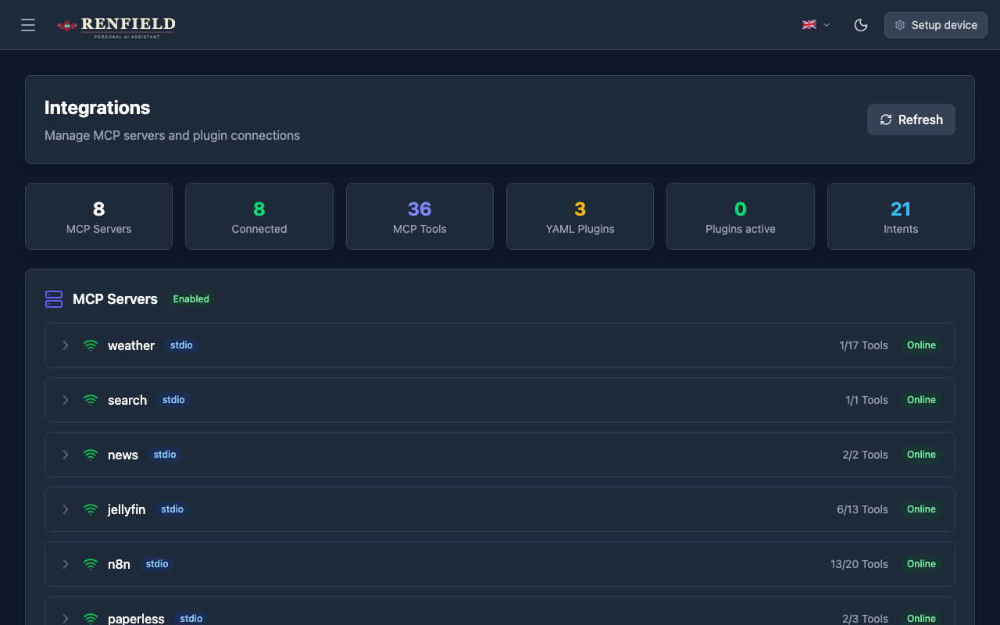
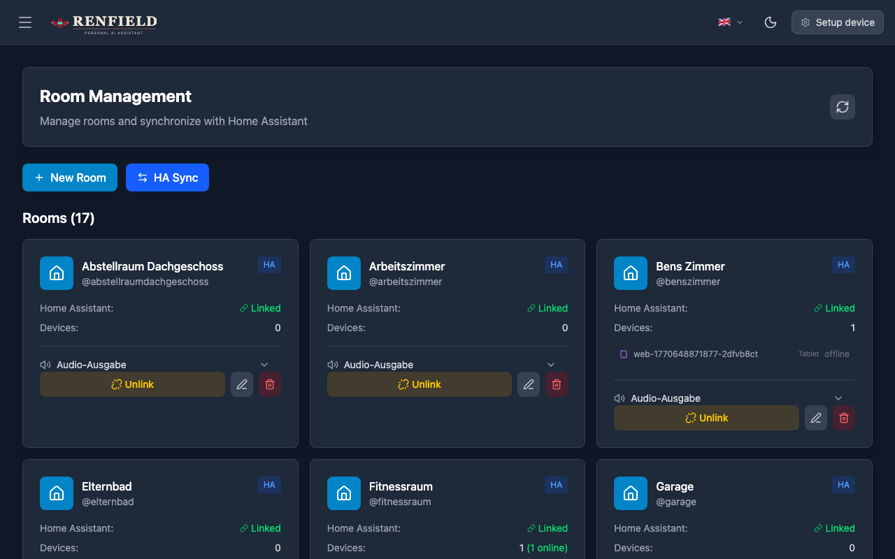
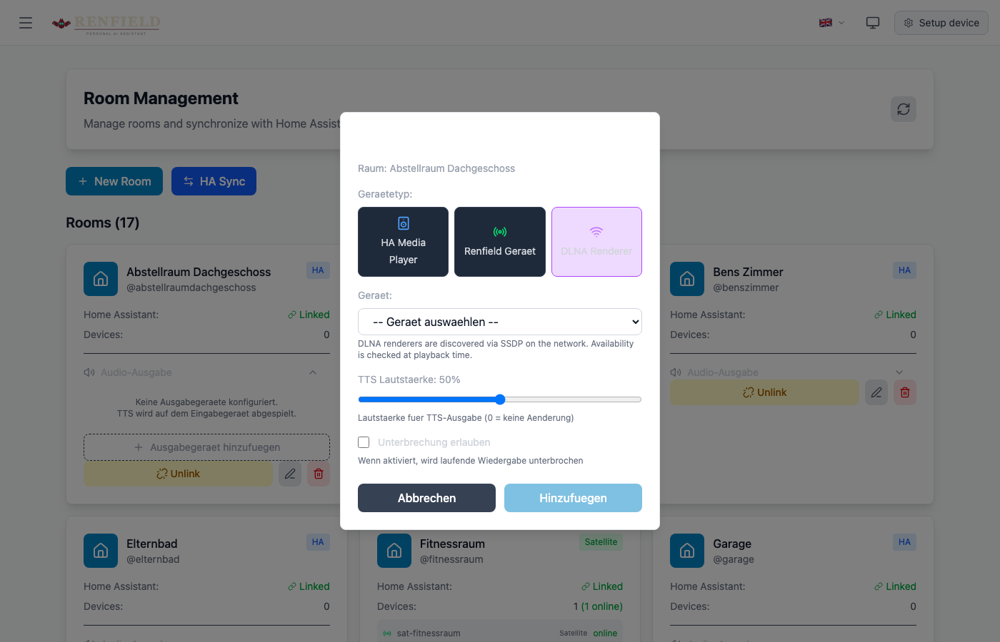
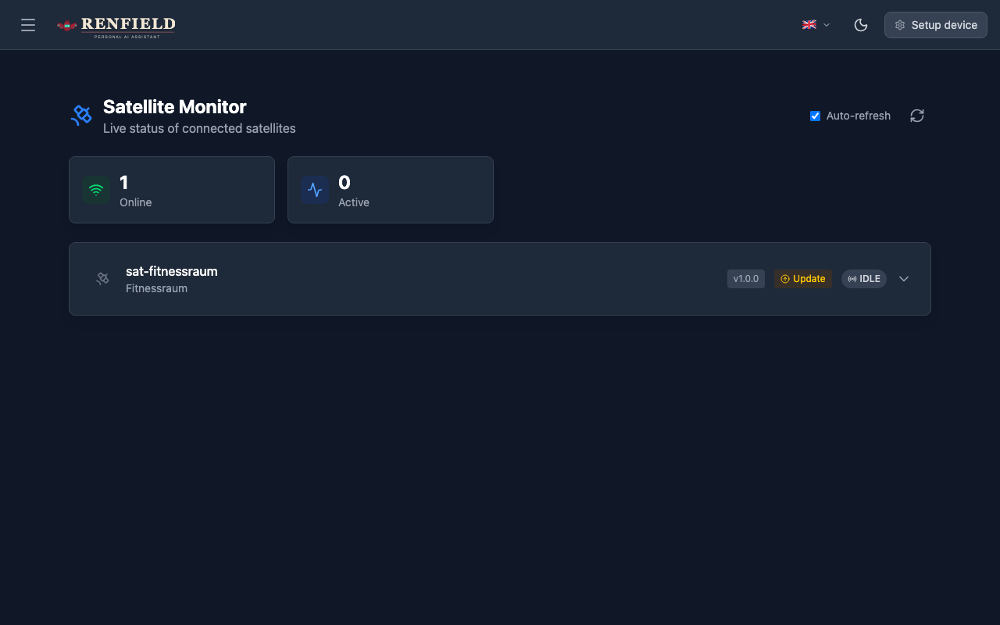
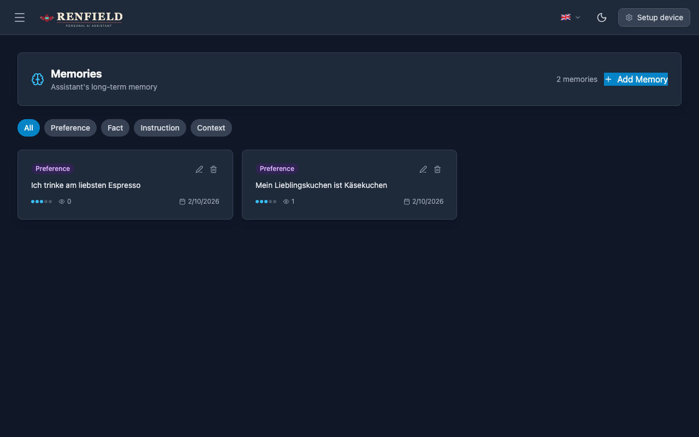
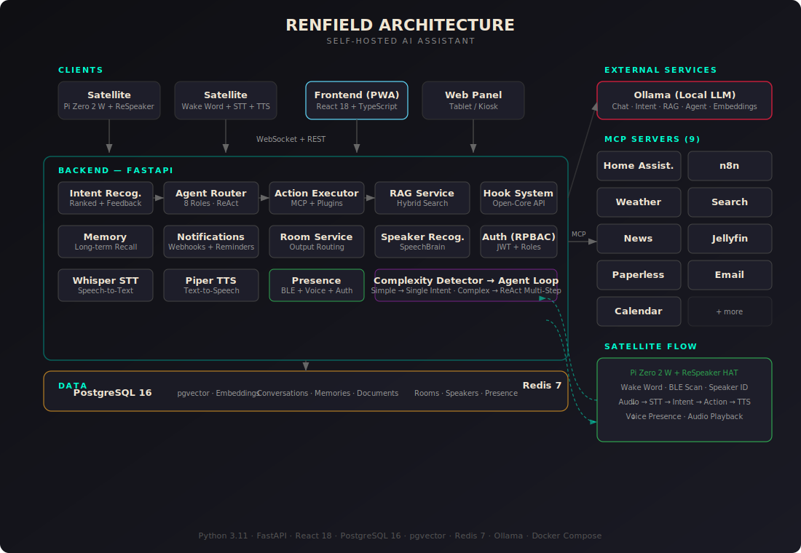

**English** | [Deutsch](README.de.md)

<div align="center">

# Renfield

**Self-hosted AI assistant with voice satellites, 100+ tool integrations, and full offline capability.**

[](https://python.org)
[](https://fastapi.tiangolo.com)
[](https://react.dev)
[](https://ollama.ai)
[](LICENSE)
[](tests/)

</div>

---

## Why Renfield?

- **Voice-first with physical satellites** — Raspberry Pi Zero 2 W + ReSpeaker HAT in every room (~$30/satellite). Wake word, STT, TTS — fully local.
- **10 MCP servers, 100+ tools, Agent Loop** — Weather, search, news, calendar, smart home, media, DLNA, documents, email, workflows. ReAct agent chains tools autonomously for complex queries.
- **Fully offline, self-hosted, GDPR-friendly** — Runs entirely on your hardware. No cloud dependencies. Your data never leaves your network.

## Screenshots

<details>
<summary><b>Chat Interface</b> — Conversation history, streaming responses, voice input</summary>
<p align="center"></p>
</details>

<details>
<summary><b>Knowledge Base (RAG)</b> — Document upload, hybrid search, knowledge bases</summary>
<p align="center"></p>
</details>

<details>
<summary><b>Integrations</b> — 10 MCP servers, 100+ tools</summary>
<p align="center"></p>
</details>

<details>
<summary><b>Room Management</b> — 17 rooms synced with Home Assistant, DLNA renderer assignment</summary>
<p align="center"></p>
</details>

<details>
<summary><b>DLNA Output Device</b> — Assign DLNA renderers to rooms for album playback</summary>
<p align="center"></p>
</details>

<details>
<summary><b>Satellite Monitor</b> — Live status of voice satellites</summary>
<p align="center"></p>
</details>

<details>
<summary><b>Memory</b> — Long-term recall of preferences and facts</summary>
<p align="center"></p>
</details>

## Features

### Core
- **Chat interface** with streaming responses, conversation history, follow-up questions
- **ReAct Agent System** with specialized roles and multi-step tool chaining
- **Knowledge Graph** — entity-relation triples extracted from conversations and documents, semantic entity resolution via pgvector
- **Conversational memory** — long-term recall of preferences, facts, and instructions with contradiction detection
- **Intent feedback learning** — learns from corrections via semantic matching (3-scope: intent, tool, complexity)
- **Voice I/O** — Whisper STT + Piper TTS + SpeechBrain speaker recognition
- **Presence detection** — BLE scanning, voice recognition, and web auth track who's in which room
- **Proactive notifications** — webhook-based alerts from Home Assistant/n8n + generic MCP notification polling
- **Hook/Plugin system** — async extension API for custom integrations without modifying core

### Integrations (10 MCP Servers)

| Server | Description | Transport |
|--------|-------------|-----------|
| Weather | OpenWeatherMap forecasts | stdio |
| Search | SearXNG metasearch | stdio |
| News | NewsAPI headlines | stdio |
| Calendar | Exchange, Google, CalDAV (multi-account) | stdio |
| Jellyfin | Media server queries | stdio |
| DLNA | Media renderer control with gapless queue | streamable_http |
| n8n | Workflow automation | stdio |
| Home Assistant | Smart home control | streamable_http |
| Paperless | Document management | stdio |
| Email | IMAP/SMTP | stdio |

### Knowledge Base (RAG)
- **Hybrid search** — dense embeddings (pgvector) + BM25 full-text, combined via RRF
- **Formats** — PDF, DOCX, PPTX, XLSX, HTML, Markdown, TXT
- **Knowledge bases** — thematic collections with sharing and access control
- **Knowledge Graph** — entity-relation triples extracted from documents and conversations, semantic entity resolution, admin dashboard

### Multi-Room Voice Satellites

| Component | Cost |
|-----------|------|
| Raspberry Pi Zero 2 W | ~$18 |
| ReSpeaker 2-Mics Pi HAT | ~$12 |
| MicroSD, power supply, speaker | ~$28 |
| **Total per room** | **~$58** |

- Local wake word detection (OpenWakeWord)
- Audio output routing to best device per room (Renfield, HA, DLNA)
- IP-based room context detection

### Presence Detection

Multi-source room-level presence tracking:

| Source | Trigger | Latency |
|--------|---------|---------|
| BLE Scanning | Satellite detects phone/watch via Bluetooth | ~30s (hysteresis) |
| Voice Presence | Speaker recognition identifies user | Instant |
| Web Auth | Authenticated user on room-assigned device | Instant |

- **Privacy-aware TTS** — notifications respect room occupancy (public / personal / confidential)
- **Automation hooks** — `enter_room`, `leave_room`, `first_arrived`, `last_left` events fire webhooks for n8n / Home Assistant
- **Presence dashboard** — real-time room occupancy in the admin UI

### Security & Access Control
- Role-permission based access control (RPBAC) with JWT
- Rate limiting, circuit breakers, trusted proxy support
- Docker secrets management for production

### Platform
- Progressive Web App (desktop, tablet, mobile)
- Dark mode (light, dark, system)
- Multilingual (German, English)
- Prometheus metrics (opt-in)

## Quick Start

```bash
git clone https://github.com/ebongard/renfield.git && cd renfield
cp .env.example .env                          # configure your settings
docker compose up -d                          # start the stack
docker exec -it renfield-ollama ollama pull qwen3:8b  # download LLM
```

Open **http://localhost:3000** and start chatting.

> For GPU acceleration, use `docker compose -f docker-compose.prod.yml up -d` with NVIDIA Container Toolkit.

## Architecture

<p align="center"></p>

## Configuration

All settings via `.env`, loaded by Pydantic Settings. See [docs/ENVIRONMENT_VARIABLES.md](docs/ENVIRONMENT_VARIABLES.md) for the full reference.

### LLM (Multi-Model)

Separate models for different tasks:

```env
OLLAMA_URL=http://ollama:11434
OLLAMA_CHAT_MODEL=qwen3:14b       # chat responses
OLLAMA_INTENT_MODEL=qwen3:8b      # intent recognition
OLLAMA_RAG_MODEL=qwen3:14b        # RAG answers
OLLAMA_EMBED_MODEL=nomic-embed-text  # embeddings (768 dim)
```

See [docs/LLM_MODEL_GUIDE.md](docs/LLM_MODEL_GUIDE.md) for model recommendations.

### Key Settings

```env
AGENT_ENABLED=false               # ReAct agent loop (opt-in)
MEMORY_ENABLED=false              # long-term memory (opt-in)
AUTH_ENABLED=false                 # RPBAC auth (opt-in)
MCP_ENABLED=true                  # master switch for integrations
PRESENCE_ENABLED=false            # room presence detection (opt-in)
KNOWLEDGE_GRAPH_ENABLED=false     # entity-relation extraction (opt-in)
NOTIFICATION_POLLER_ENABLED=false # proactive MCP notifications (opt-in)
METRICS_ENABLED=false             # Prometheus /metrics (opt-in)
```

## Development

```bash
make lint                    # lint all code (ruff + eslint)
make test                    # all tests
make test-backend            # backend tests (2,100+)
make test-frontend-react     # React tests (Vitest + RTL)
make test-coverage           # tests with coverage report
```

See [CONTRIBUTING.md](CONTRIBUTING.md) for the full development guide.

## Docker Compose Variants

| File | Use Case | GPU |
|------|----------|-----|
| `docker-compose.yml` | Standard | No |
| `docker-compose.dev.yml` | Development (Mac) | No |
| `docker-compose.prod.yml` | Production | NVIDIA |
| `docker-compose.prod-cpu.yml` | Production | No |

## Documentation

| Document | Content |
|----------|---------|
| [CONTRIBUTING.md](CONTRIBUTING.md) | How to contribute |
| [docs/FEATURES.md](docs/FEATURES.md) | Detailed feature documentation |
| [docs/ENVIRONMENT_VARIABLES.md](docs/ENVIRONMENT_VARIABLES.md) | Full configuration reference |
| [docs/LLM_MODEL_GUIDE.md](docs/LLM_MODEL_GUIDE.md) | Model recommendations |
| [docs/DEPLOYMENT.md](docs/DEPLOYMENT.md) | Deployment guide |
| [docs/SECRETS_MANAGEMENT.md](docs/SECRETS_MANAGEMENT.md) | Docker secrets for production |
| [docs/SECURITY.md](docs/SECURITY.md) | Security headers, CSP, dependency security |
| [docs/ACCESS_CONTROL.md](docs/ACCESS_CONTROL.md) | Role-based access control & MCP permissions |
| [docs/SPEAKER_RECOGNITION.md](docs/SPEAKER_RECOGNITION.md) | Speaker recognition |
| [docs/OUTPUT_ROUTING.md](docs/OUTPUT_ROUTING.md) | Audio output routing |
| [docs/PROACTIVE_NOTIFICATIONS.md](docs/PROACTIVE_NOTIFICATIONS.md) | Webhook notifications & proactive alerts |
| [docs/MULTILANGUAGE.md](docs/MULTILANGUAGE.md) | Internationalization (i18n) |
| [docs/WAKEWORD_CONFIGURATION.md](docs/WAKEWORD_CONFIGURATION.md) | Wake word detection setup |
| [docs/EXTERNAL_OLLAMA.md](docs/EXTERNAL_OLLAMA.md) | External Ollama instances |
| [docs/SATELLITE_MONITORING.md](docs/SATELLITE_MONITORING.md) | Satellite monitoring |
| [docs/SATELLITE_OTA_UPDATES.md](docs/SATELLITE_OTA_UPDATES.md) | Satellite over-the-air updates |
| [docs/AUDIO_CAPTURE_4MIC.md](docs/AUDIO_CAPTURE_4MIC.md) | ReSpeaker 4-Mic array support |
| [CLAUDE.md](CLAUDE.md) | Developer reference (architecture, patterns) |

## Disclaimer

Renfield is an independent open-source project. It is not affiliated with, endorsed by, or connected to any third party, organization, company, or brand with the same or similar name.

## Acknowledgments

- [Ollama](https://ollama.ai/) — Local LLM inference
- [Whisper](https://github.com/openai/whisper) — Speech-to-text
- [Piper](https://github.com/rhasspy/piper) — Text-to-speech
- [SpeechBrain](https://speechbrain.github.io/) — Speaker recognition (ECAPA-TDNN)
- [IBM Docling](https://github.com/DS4SD/docling) — Document processing for RAG
- [pgvector](https://github.com/pgvector/pgvector) — Vector similarity search
- [Home Assistant](https://www.home-assistant.io/) — Smart home platform
- [n8n](https://n8n.io/) — Workflow automation
- [SearXNG](https://docs.searxng.org/) — Metasearch engine
- [OpenWakeWord](https://github.com/dscripka/openWakeWord) — Wake word detection

## License

MIT License — see [LICENSE](LICENSE) file.

## Contributing

Contributions are welcome! Please read our [Contributing Guide](CONTRIBUTING.md) and check the [good first issues](https://github.com/ebongard/renfield/labels/good-first-issue).
