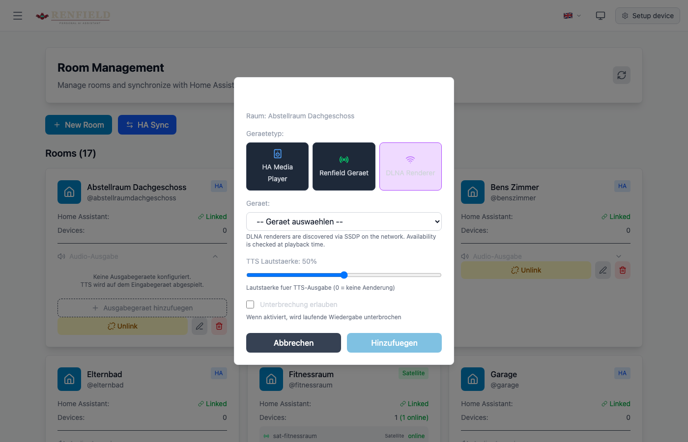

# Audio/Visual Output Device Routing System

Renfield unterstützt intelligentes Routing von TTS-Ausgaben an das beste verfügbare Ausgabegerät in einem Raum. Anstatt die Antwort immer auf dem Eingabegerät (z.B. Tablet, Browser) abzuspielen, kann die Ausgabe an hochwertige Lautsprecher wie HiFi-Systeme oder Smart Speaker gesendet werden.

## Features

- **Konfigurierbare Ausgabegeräte pro Raum** mit Prioritätsreihenfolge
- **Verfügbarkeitsprüfung** (eingeschaltet, nicht beschäftigt)
- **Unterbrechungs-Präferenzen** pro Gerät
- **TTS-Lautstärke** pro Gerät konfigurierbar
- **Automatischer Fallback** auf Eingabegerät bei Nichtverfügbarkeit
- **Unterstützt Renfield-Geräte** (Satellites, Web Panels), **Home Assistant Media Player** und **DLNA Renderer**
- **DLNA Renderer Discovery** via SSDP-Multicast (automatische Erkennung im Netzwerk)
- **Generische Output-Provider** (`OUTPUT_PROVIDERS_ENABLED`, opt-in) — neue Marken (Samsung TV, künftig Sonos/LG) werden room-fähig per Config-Stanza, nicht per Code

## Generische Output-Provider (`OUTPUT_PROVIDERS_ENABLED`)

Opt-in-Schicht (Standard aus → Verhalten byte-identisch zum Legacy-Routing). Quelle der Wahrheit: [`docs/design/output-providers.md`](design/output-providers.md).

Statt der drei hartkodierten Quellen (renfield / homeassistant / dlna) macht ein **Provider-Registry** ein neues Ausgabegerät zu *Config + kleinem MCP-Contract*:

- **Stanza in `mcp_servers.yaml`** (`output_provider:`) bildet die normalisierten Contract-Methoden (`discover`/`play`/`control`/`status`) auf die *echten* Tools des MCP-Servers ab — die Übersetzung lebt **vollständig im Renfield-Backend** (`ha_glue/services/output_providers.py`), nie in den (fremden) MCP-Servern.
- **`(output_provider, output_target_id)`** ersetzt die drei Marken-Spalten auf `room_output_devices` (additiv eingeführt, Dual-Read; die alten Spalten fallen in einem späteren PR weg).
- **Aggregierte Discovery**: `GET /{room}/available-outputs` liefert bei aktivem Flag eine kapazitäts-getaggte Union (`output_targets`) über alle Provider — parallel ermittelt, mit Per-Provider-Timeout (`OUTPUT_PROVIDER_DISCOVER_TIMEOUT`); ein nicht erreichbarer Provider erscheint **degradiert (nicht weggelassen)**.
- **Generischer Dispatch**: `internal.play_in_room` / `internal.media_control` routen room-aufgelöste Provider-Ziele über das Registry inkl. **Power-on** (Status off/unerreichbar → `control('on')` → Bereitschafts-Poll bis `boot_timeout` → play; weckt nicht → ehrlicher Fehler). dlna bleibt auf dem bewährten Gapless-Pfad.
- **Frontend**: `RoomOutputSettings` wird datengetrieben — ein einziger Picker über alle Provider mit Capability-Badges; ein neues Gerät erfordert **keine** UI-Änderung.

Erste Marke: **Samsung TV** (`renfield-mcp-samsung`) — wird damit room-auswählbar, room-abspielbar und room-steuerbar.

## Voraussetzungen

### ADVERTISE_HOST Konfiguration

Damit HA Media Player und DLNA Renderer die TTS-Audio-Dateien vom Renfield-Backend abrufen können, müssen `ADVERTISE_HOST`/`ADVERTISE_SCHEME`/`ADVERTISE_PORT` gesetzt sein. Das Backend baut daraus die URL `…/api/voice/tts-cache/{id}.wav`, die der Renderer selbst abruft.

```bash
# .env (k8s-Prod-Werte)
ADVERTISE_HOST=renfield.local  # per DNS (Linn/Samsung) bzw. /etc/hosts (HiFiBerry) auflösbar
ADVERTISE_SCHEME=http          # NICHT https — Samsung-TVs akzeptieren self-signed nicht; http geht überall
ADVERTISE_PORT=80
```

**Wichtig:**
- **`http`, nicht `https`** — DLNA-Renderer (v.a. Samsung-TVs) akzeptieren das self-signed Zertifikat nicht; plain http funktioniert auf allen Renderern.
- Der Pfad `/api/voice/tts-cache/` muss **plain HTTP ohne HTTPS-Redirect** bedient werden — in k8s über die `backend-tts-cache-http` Traefik-IngressRoute (eigener `web`-Entrypoint-Route, `priority: 100`), nicht Nginx.
- DLNA-Renderer schicken ein **HEAD vor dem GET** und verlangen `audio/x-wav` + eine `.wav`-Resource — die Route bedient das (sonst Samsung-UPnP-716). Details: `docs/MESSAGE_RELAY.md` → „TTS-Audio-Auslieferung an Renderer".
- Geräte-Setup: Linn/Samsung brauchen keins; HiFiBerry braucht den `/etc/hosts`-Eintrag aus `provision-hifiberry.yml` (über http **keine CA** nötig).

## Konfiguration über das Frontend

1. Öffne die **Raumverwaltung** (`/rooms`)
2. Klicke auf **"Audio-Ausgabe"** bei einem Raum um die Einstellungen zu öffnen
3. Klicke auf **"Ausgabegerät hinzufügen"**
4. Wähle den Gerätetyp:
   - **HA Media Player**: Home Assistant Media Player Entitäten (z.B. Sonos, Chromecast, HiFi-Systeme)
   - **Renfield Gerät**: Renfield Satellites oder Web Panels mit Lautsprechern
   - **DLNA Renderer**: DLNA-fähige Geräte im Netzwerk (z.B. Linn, Samsung TV, HiFiBerry). Werden per SSDP automatisch erkannt.
5. Konfiguriere die Einstellungen:
   - **TTS Lautstärke**: Lautstärke für TTS-Ausgabe (0-100%)
   - **Unterbrechung erlauben**: Wenn aktiviert, wird laufende Wiedergabe unterbrochen

### Prioritätsreihenfolge

Geräte werden in der konfigurierten Reihenfolge geprüft. Verwende die Pfeil-Buttons um die Priorität zu ändern — **Position 1 = primäres Gerät**. Das erste verfügbare Gerät wird verwendet.

**Qualitäts-Tiebreak:** Haben mehrere Geräte dieselbe Priorität (z. B. keines wurde geordnet — alle auf dem Default-Wert), entscheidet die **Audio-Qualität der Geräteklasse**: externer AV-Renderer (DLNA / Samsung / Sonos) > HA-`media_player` (Smart Speaker) > Renfield-Tablet/Satellit (interner Lautsprecher). So landet die Antwort in einem ungeordneten Raum automatisch auf dem hochwertigsten Gerät (z. B. der HiFiBerry statt dem Tablet). Die manuell gesetzte Priorität gewinnt immer zuerst; Qualität bricht nur Gleichstände (danach `id` für Determinismus).

## Routing-Algorithmus

```
1. Hole alle konfigurierten Output-Geräte für Raum, sortiert nach
   (Priorität ASC, Audio-Qualität DESC, id ASC)
   — Priorität = manuelle Primär-Reihenfolge; Qualität bricht Gleichstände
     (externer Renderer > HA-Speaker > Renfield-Tablet)
2. Für jedes Gerät (in dieser Reihenfolge):
   a. Prüfe Verfügbarkeit via HA API / DeviceManager
   b. Wenn verfügbar (idle/paused) → verwenden
   c. Wenn beschäftigt UND allow_interruption=True → verwenden
   d. Wenn beschäftigt UND allow_interruption=False → nächstes probieren
   e. Wenn aus/nicht erreichbar → nächstes probieren
3. Wenn kein konfiguriertes Gerät verfügbar:
   → Fallback auf Eingabegerät (wenn es Speaker hat)
4. Wenn nichts verfügbar → Keine Audio-Ausgabe
```

**Stationär vs. mobil:** Der Raumkontext wird per **IP des registrierten Raumgeräts** aufgelöst (`resolve_room_context_by_ip`). Ein nicht registriertes, mobiles Gerät (Handy/Laptop) trifft keinen Raum → kein Routing → die Antwort spielt im **Browser**. „Stationär" ≡ „als Raumgerät registriert". Chat-TTS wird serverseitig an `homeassistant`- **und** `dlna`-Ziele zugestellt (der Renderer bekommt die volle Antwort als einen Clip); `renfield`-Ziele = das Eingabegerät selbst → der Browser spielt.

### Verfügbarkeitsstatus

| Status | Beschreibung | Routing-Verhalten |
|--------|--------------|-------------------|
| `AVAILABLE` | Bereit (idle, paused, standby) | Wird verwendet |
| `BUSY` | Spielt gerade (playing, buffering) | Nur wenn `allow_interruption=True` |
| `OFF` | Ausgeschaltet | Wird übersprungen |
| `UNAVAILABLE` | Nicht erreichbar | Wird übersprungen |

**Hinweis:** DLNA-Renderer gelten immer als `AVAILABLE` — SSDP-Probing zur Laufzeit wäre zu teuer für Routing-Entscheidungen. Die tatsächliche Verfügbarkeit wird erst beim Abspielen geprüft.

## API Endpoints

### Output-Geräte für einen Raum

```bash
# Alle konfigurierten Ausgabegeräte abrufen
GET /api/rooms/{room_id}/output-devices

# Ausgabegerät hinzufügen
POST /api/rooms/{room_id}/output-devices
{
  "output_type": "audio",
  "ha_entity_id": "media_player.wohnzimmer",
  "priority": 1,
  "allow_interruption": false,
  "tts_volume": 0.5
}

# Ausgabegerät aktualisieren
PATCH /api/rooms/output-devices/{device_id}
{
  "priority": 2,
  "allow_interruption": true,
  "tts_volume": 0.3,
  "is_enabled": true
}

# Ausgabegerät entfernen
DELETE /api/rooms/output-devices/{device_id}

# Prioritäten neu ordnen
POST /api/rooms/{room_id}/output-devices/reorder?output_type=audio
{
  "device_ids": [3, 1, 2]
}

# Verfügbare Ausgabegeräte abrufen (Renfield + HA + DLNA)
GET /api/rooms/{room_id}/available-outputs
```

### TTS Cache (für HA Media Player)

```bash
# TTS-Audio abrufen (wird von HA Media Playern verwendet)
GET /api/voice/tts-cache/{audio_id}
```

## Datenbank-Schema

```sql
CREATE TABLE room_output_devices (
    id SERIAL PRIMARY KEY,
    room_id INTEGER NOT NULL REFERENCES rooms(id),
    output_provider VARCHAR(50),    -- "renfield" | "homeassistant" | "dlna" | "samsung" | "sonos" | …
    output_target_id VARCHAR(255),  -- provider-scoped id (device_id / HA entity / renderer name / TV host …)
    output_type VARCHAR(20) NOT NULL DEFAULT 'audio',
    priority INTEGER NOT NULL DEFAULT 1,
    allow_interruption BOOLEAN DEFAULT FALSE,
    tts_volume FLOAT DEFAULT 0.5,
    device_name VARCHAR(255),
    is_enabled BOOLEAN DEFAULT TRUE,
    created_at TIMESTAMP,
    updated_at TIMESTAMP
);
```

**Hinweis:** Die Ausgabeziel-Identität ist das generische Paar
`(output_provider, output_target_id)` — `output_provider` IST der `target_type`-
Wertebereich. Die drei früheren markenspezifischen Spalten (`renfield_device_id`
/ `ha_entity_id` / `dlna_renderer_name`) wurden nach der Prod-Soak in Migration
`pc20260617b_drop_outlegacy` entfernt (siehe `docs/design/output-providers.md`).
Die REST-API akzeptiert die alten Feldnamen weiterhin als reine
Eingabe-Adapter und gibt sie aus dem Paar berechnet zurück
(Abwärtskompatibilität).

### Gerätetypen

`output_provider` benennt den Typ, `output_target_id` den providerspezifischen Identifikator.

| Typ | `output_provider` | Discovery | Verfügbarkeitsprüfung |
|-----|---------------|-----------|----------------------|
| Renfield | `renfield` | DeviceManager (WebSocket) | Echtzeit (online/offline) |
| Home Assistant | `homeassistant` | HA API (`media_player.*`) | HA State API (idle/playing/off) |
| DLNA | `dlna` | SSDP-Multicast via MCP | Immer `AVAILABLE` (kein Probing) |
| Generisch (samsung/sonos/…) | Provider-Key aus `mcp_servers.yaml` | Provider-`discover()` | Provider-`status()` |

## DLNA Renderer

DLNA-Renderer werden über den **DLNA MCP Server** erkannt. Dieser läuft als eigenständiger Host-Service (nicht im Docker-Container), da SSDP-Multicast (`239.255.255.250:1900`) LAN-Zugang benötigt.

### Architektur

```
DLNA Renderer (LAN)     DLNA MCP Server (Host)     Backend (Docker)
    ↑                        ↑                          ↑
    │ SSDP Multicast         │ streamable-http          │
    └────────────────────────┘                          │
                             └──────────────────────────┘
                              http://host.docker.internal:9091/mcp
```

### Setup

1. **DLNA MCP installieren** (auf dem Host, nicht im Container):
   ```bash
   pip install /opt/renfield-mcp-dlna/
   ```

2. **Systemd-Service** (`/etc/systemd/system/renfield-mcp-dlna.service`):
   ```ini
   [Service]
   Environment=MCP_TRANSPORT=streamable-http
   Environment=MCP_PORT=9091
   ExecStart=/home/user/.local/bin/renfield-mcp-dlna
   ```

3. **Backend-Konfiguration** (`mcp_servers.yaml`):
   ```yaml
   - name: dlna
     transport: streamable_http
     url: "${DLNA_MCP_URL:-http://host.docker.internal:9091/mcp}"
     enabled: "${DLNA_MCP_ENABLED:-false}"
   ```

4. **Environment** (`.env`):
   ```bash
   DLNA_MCP_ENABLED=true
   # DLNA_MCP_URL=http://host.docker.internal:9091/mcp  # Default
   ```

### Screenshot

<p align="center"></p>

## DLNA Album Playback

Neben TTS-Routing unterstützt das DLNA-System lückenlose Album-Wiedergabe:

### Ablauf

```
User: "Spiele Afterburner von ZZ Top im Arbeitszimmer"

1. Agent sucht Album in Jellyfin → findet Album + Tracks + Album Art URL
2. internal.play_album_on_dlna: Tracks werden an DLNA MCP Server übergeben
3. DLNA MCP Server queued Tracks gapless auf dem Renderer im Zielraum
4. Album Art wird als Inline-Bild in der Chat-Antwort gerendert
5. Metadaten (Titel, Artist, Cover) werden an den Player weitergegeben
```

### Features

- **Gapless Queue** — Tracks werden lückenlos nacheinander abgespielt
- **Album Art im Chat** — Jellyfin-Bild-URLs werden als `` direkt in der Chat-Nachricht angezeigt
- **Transcode Fallback** — Inkompatible Audio-Formate (FLAC → WAV) werden automatisch transkodiert
- **Transport Shortcuts** — `stop`, `pause`, `play`, `skip` umgehen den Agent Loop für sofortige Reaktion

## Beispiel-Szenario

**Küche Setup:**
- Tablet (Eingabegerät, has_speaker=true)
- Sonos Speaker (HA: `media_player.kuche_sonos`, Priorität 1, allow_interruption=false)
- Echo Dot (HA: `media_player.kuche_echo`, Priorität 2, allow_interruption=true)

**Ablauf bei Sprachbefehl:**

```
User spricht zum Tablet: "Wie ist das Wetter?"

1. System verarbeitet und generiert TTS-Antwort

2. OutputRoutingService prüft:
   - Sonos Speaker Status? → "playing" (spielt Musik)
   - allow_interruption? → false
   - → Nächstes Gerät probieren

3. OutputRoutingService prüft:
   - Echo Dot Status? → "idle"
   - → Verwenden!

4. AudioOutputService:
   - Speichert TTS als Cache-Datei
   - Setzt Lautstärke auf konfiguriertem Wert
   - Ruft HA service media_player.play_media
   - Echo Dot spielt Antwort ab

5. Frontend erhält tts_handled=true
   - Überspringt lokale TTS-Wiedergabe
```

## Troubleshooting

### TTS wird nicht auf HA Media Player / DLNA Renderer abgespielt

1. **ADVERTISE_* prüfen:**
   ```bash
   kubectl -n renfield exec deploy/backend -c backend -- env | grep ADVERTISE
   ```
   Prod: `ADVERTISE_HOST=renfield.local`, `ADVERTISE_SCHEME=http`, `ADVERTISE_PORT=80`.

2. **Kann der Renderer die URL erreichen?**
   ```bash
   # Von einem anderen Gerät im LAN testen (HEAD, wie ein DLNA-Renderer):
   curl -I http://renfield.local/api/voice/tts-cache/test
   # Erwartung: 404 (Not Found) = Endpoint erreichbar (HEAD wird bedient)
   # 405 = HEAD nicht unterstützt (alte Version → Samsung-716)
   # 301 = HTTPS-Redirect → die backend-tts-cache-http IngressRoute fehlt/greift nicht
   # Connection refused = Route/Host falsch
   ```
   Auf dem Renderer-Gerät selbst muss `renfield.local` auflösen (Linn/Samsung: Router-DNS; HiFiBerry: `/etc/hosts`).

3. **Media Player Status prüfen:**
   ```bash
   curl http://localhost:8000/api/rooms/{room_id}/available-outputs
   ```

### TTS wird doppelt abgespielt (Browser + Media Player)

- Prüfe ob das Frontend aktuell ist (Frontend muss `tts_handled` Flag respektieren)
- Browser-Cache leeren und Seite neu laden

### Timeout-Fehler bei play_media

Der Service hat einen 30-Sekunden-Timeout. Bei sehr langsamen Netzwerken oder großen Audio-Dateien kann es zu Timeouts kommen. Die Audio-Datei wird trotzdem abgespielt, aber das System meldet einen Fehler.

## Technische Details

### Betroffene Dateien

| Datei | Beschreibung |
|-------|--------------|
| `backend/models/database.py` | `RoomOutputDevice` Model |
| `backend/services/output_routing_service.py` | Routing-Logik |
| `backend/services/audio_output_service.py` | Audio-Delivery |
| `backend/api/routes/rooms.py` | API Endpoints |
| `backend/api/routes/voice.py` | TTS Cache Endpoint |
| `backend/main.py` | WebSocket Integration |
| `frontend/src/components/RoomOutputSettings.jsx` | UI Komponente |
| `frontend/src/pages/RoomsPage.jsx` | Integration |
| `frontend/src/pages/ChatPage/index.jsx` | `tts_handled` Flag Handling |

### WebSocket Protocol Erweiterung

Das `done` Message enthält jetzt ein `tts_handled` Flag:

```json
{
  "type": "done",
  "tts_handled": true
}
```

- `tts_handled: true` → TTS wurde an externes Gerät gesendet, Frontend überspringt lokale Wiedergabe
- `tts_handled: false` → Frontend spielt TTS lokal ab (wie bisher)
